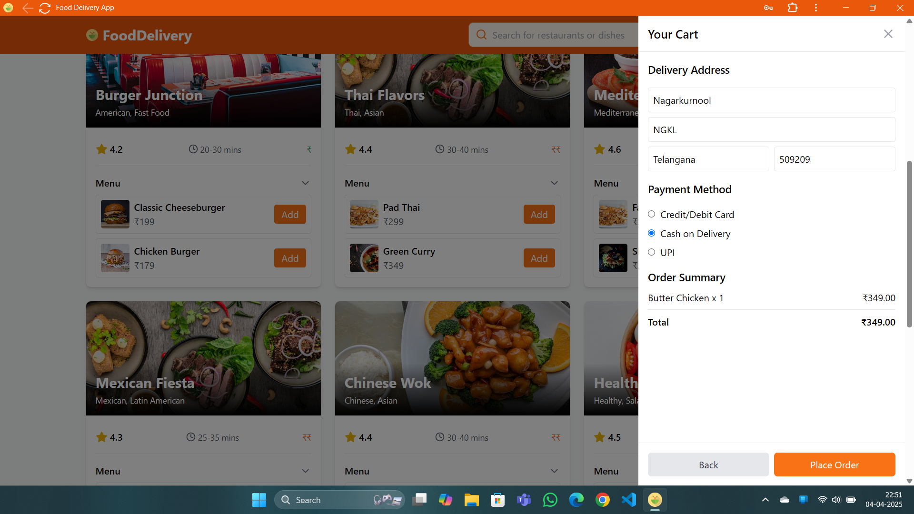

# Food Delivery Application

A full-stack MERN (MongoDB, Express, React, Node.js) application for food delivery services.

## Live link: https://deepuchary-fd.vercel.app/
## Screenshots

## Setup Instructions

### Prerequisites
- Node.js (v14 or higher)
- MongoDB (running locally or a remote connection)

### Installation

1. Clone the repository
2. Install dependencies:
   bash
   npm install
   

## Features

- User authentication (register, login, logout)
- Browse restaurants and menu items
- Search functionality
- Add items to cart
- Checkout process
- Order history
- Responsive design

